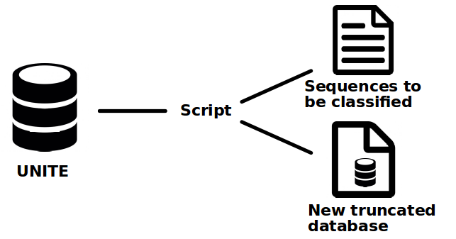
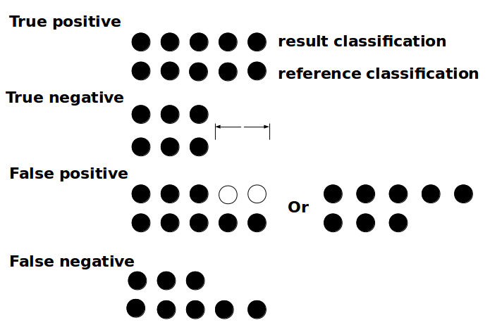

# CREST evaluation

## Objectives:
In this investigation, the testing of taxonomic classification software with different databases is carried out because a reliable assessment of taxonomy at species level is indispensable nowadays for understanding microbiomes. 

This project was carried out in order to investigate the performance of the CREST against different classifiers. With this aim in mind, the objectives are to:

* Test and evaluate the performance of each software after a removal-of-taxa cross-validation test.
* Test and evaluate the performance of each software after a ten-fold cross-validation test.
------------

## Software tested:
* LCA classifier (CREST)
* SINTAX

-----------
## Databases tested:
### UNITE:
* UNITE v7 (23,264 seq) implemented in CREST (Lanzen et al.,2012)
* UNITE (53,693 seq) formatted for SINTAX http://www.drive5.com/usearch/manual/sintax_downloads.html and filtered to contained the same accession numbers as the version of CREST.

## MATERIALS AND METHODS

Two types of test were experienced: removal-of-taxa cross-validation and ten-fold cross-validation.

For each test, the software was first tested by classifying full length sequences and on sequences that had been shortened by an Illumina MiSeq v3 (MSv3) simulator to 250bp and that inserted errors characteristic of this sequencing platform (Huang et al., 2012).

The removal-of-taxa cross-validation consisted of randomly removing a whole taxon from the database and to classify the removed sequences using the truncated database generated that does not contain the taxon itself.

*This means for example that if the class Agaricomycetes is selected to be removed, then all the reference sequences that belongs to this taxon and its child taxa are extracted and deleted from the database. The extracted sequences are then classified against the truncated database. We based this test on the removal of whole classes, orders, families and genera.*

The ten-fold cross-validation on the other hand, consisted of extracting 10% of sequences picked randomly from the database and to classify them using the truncated database.

### CREST - LCA Classifier - Evaluation:
#### Implementation:
The LCA Classifier program of CREST uses alignment data generated by an initial alignment of the dataset against a reference database using BLASTN. The classification is then carried out by the program based on a subset of best matching alignments to the Lower Common Ancestor (LCA) of this subset. The program uses minimum similarity filters for the classification of 16S rRNA but in the case of the ITS classification, these filters were disabled (Lanzen et al.,2012).

### Software evaluation

**Removal-of-taxa cross validation**
  - Scripts used:
* Scripts/Bash/taxa_removal_FL_LCA.sh
* Scripts/Bash/taxa_removal_250bp_LCA.sh
* Scripts/Python/taxa_removal_LCA.py (*Implemented in CREST*)
* Scripts/Python/evaluate_LCA.py (*Implemented in CREST*)

  - Pipeline:

For this test, we made two distinct pipelines, one to classify full length sequences (*taxa_removal_FL_LCA.sh*) and one for the shortened sequences (*taxa_removal_250bp_LCA.sh*).

The creation of the test datasets and truncated reference databases is the first step. To do that the Python script "taxa_removal_LCA.py" was implemented. This script takes the UNITE database as argument and a list of taxon names (Tedersoo et al., 2014) of the rank that we want to extract. Then it selects randomly a taxon from the list and extracts all the sequences corresponding to this taxon and their children from the reference truncated database. The process is illustrated in Figure 1.

**Figure 1. Global functioning of the creation of new datasets.** *The original UNITE database is divided in two output, one containing the isolated sequences we want to classify and the truncated database that does not contains those sequence anymore.*

An optional step is added after the creation of the dataset to simulate 250bp read from Illumina MSv3 sequencing by using ART-Illumina.

To classify the 250bp and the full length sequences, the next step was the indexing of the new truncated database for BLASTN. Then the alignment of the sequences against the new database is done with BLASTN and the "-task megablast" option.

The Python script written for the analysis of the output generated by CREST (*evaluate_LCA.py*) takes the classification file resulting from the LCA Classifier of CREST and calculates the number of true positives, true negatives, false positives and false negatives at each rank ranging from domain to genus. These results can be defined by the correspondence of the taxa from the classified sequences against how they were supposed to be classified in the reference database (Figure 2).

**Figure 2. Illustration of the evaluation of the classification.** *The evaluation is counting the
number of true positives, true negatives, false positives and false negatives. The top set of circle
represent the taxonomy delivered by the software after the test while the bottom set represent the
original taxonomy as found on the database. If the two strand have the same color, it means that
they belongs to the same taxon. If there is nothing then the sequence is not classified to this level,
the taxon is unknown.*

With these results, The accuracy of classification at each rank is calculated using the following equation:

$$ Accuracy = (TP+TN)/(TP+TN+FP+FN) $$ 
Equation (1).

For the removal-of-taxa cross-validation test the sequences that were submitted for a classification belonged to a taxon that was removed from the database. Therefore no classification from the taxon removed to the lowest level is possible and the result is counted as a true negative.

**Ten-fold cross-validation**
  - Scripts used:
* Scripts/Python/ten_fold_LCA.py
* Scripts/Bash/ten_fold_pipeline_250bp_LCA.sh
* Scripts/Bash/ten_fold_pipeline_FL_LCA.sh
* Scripts/Python/evaluate_LCA.py (*Implemented in CREST*)

  - Pipeline
The script written for this test, "ten_fold_LCA.py", extracts randomly 10 percent of all the sequence in the UNITE database and output a new database containing all the sequences from UNITE except those extracted.
*This script is easily editable to change the percentage of sequences extracted*

The scripts for the overall pipeline of full length sequences classification and 250bp
sequences classification are respectively called "ten_fold_pipeline_FL_LCA.sh"
and "ten_fold_pipeline_250bp_LCA.sh" and the evaluation is done with the same
"evaluate_LCA.py" script and the accuracy calculated with the equation (1).

### For Sintax:
The SINTAX evaluation follow the same pipeline as CREST but a cut off of 0.6 was chosen.

#### Implementation
The SINTAX algorithm predicts taxonomy by using k-mer similarity to identify
top hit in a reference database and provides bootstrap confidence for all ranks in
the prediction. (Edgar, 2016)

#### Software evaluation
**Removal-of-taxa cross validation**
  - Scripts used:
* Scripts/Bash/taxa_removal_FL_sintax.sh
* Scripts/Bash/taxa_removal_250bp_sintax.sh
* Scripts/Python/taxa_removal_sintax.py
* Scripts/Python/evaluate_sintax.py

  - Pipeline
For this test, a similar set of scripts as the ones written for CREST was created
to generate the datasets and implement the pipelines.

The datasets are generated by the same principle as for CREST (see Figure 1) by the script "taxa_removal_sintax.py". The same taxa extracted in CREST were extracted in SINTAX too, in order to generate more comparable results.
After this first step, the simulation of Illumina MVs3 sequencing was carried out
to generate 250bp test sequences.

To classify the different kind of sequences (Full length and shortened ones), the next step was to create database files that can be read by SINTAX. For that the "-makeudb_sintax" option of USEARCH was used. It converts a FASTA file to a file formatted for SINTAX (.udb). Then, the SINTAX function of USEARCH, called by the "-sintax" option, was used to compare the extracted sequences
against the database in order to classify them.

The evaluation script "evaluate_sintax.py" was designed to evaluate the SINTAX results given a specific cut off, here 0.6. If a rank was assigned with a value inferior to the bootstrap, it was considered as a false negative. If, instead the score was superior or equal, then the evaluation will be calculated following the same pattern as the one illustrated in Figure 2.

In the end, the accuracy is calculated using equation (1).

**Ten-fold cross-validation**
  - Scripts used
* Scripts/Python/ten_fold_sintax.py
* Scripts/Bash/ten_fold_pipeline_250bp_sintax.sh
* Scripts/Bash/ten_fold_pipeline_FL_sintax.sh
* Scripts/Python/evaluate_sintax.py

  - Pipeline

The script that generates the datasets and the reference databases "ten_fold_sintax.py" randomly extracts 10% of the sequences of the UNITE database with replacement, and outputs them in a file in addition to the new truncated database. This is the only step that differs from the removal-of-taxa cross-validation test.

The scripts for the whole pipelines for full length sequences and 250bp sequences are respectively named "ten_fold_FL_sintax.sh" and "ten_fold_250bp_sintax.sh", the evaluation and accuracy calculation use the same "evaluate_sintax.py" script and equation (1).

________________________

The duration of each test was calculated with the `user time` value given by the command `time` of bash. In the case of the ten-fold cross-validation, the time correspond to the execution time of the software only and for the removal-of-taxa cross-validation the time is a sum of the execution time of the software for each taxonomic level extracted.
